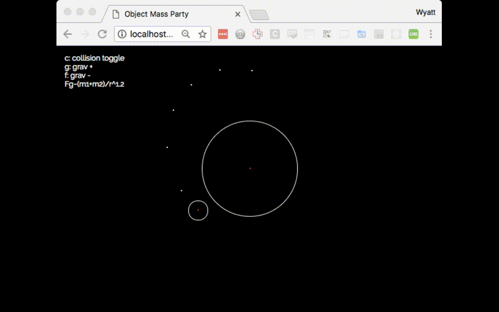

# Planet Dance Party

A n-body simulation calculated on the server-side and commutible to multiple front-ends. The app utilizes web-socket connections with its front-end and to allow for high-latancy server-client communication.

## TO RUN

npm install
npm start

## TODO
- randomly assign css color to masses
- star formation
- comet

## Done

- prevent scrollbars from appearing (overflow: hidden;)
- collision
- gravity adjustment

## Resources
- https://github.com/TeamSparkles/service-header
